# Session Resume & Persistence

This guide walks you through the SDK's session persistence capabilities—how to pause work, resume it later, and manage sessions in production environments.

## How Sessions Work

When you create a session, the Copilot CLI maintains conversation history, tool state, and planning context. By default, this state lives in memory and disappears when the session ends. With persistence enabled, you can resume sessions across restarts, container migrations, or even different client instances.

```mermaid
flowchart LR
    A[🆕 Create] --> B[⚡ Active] --> C[💾 Paused] --> D[🔄 Resume]
    D --> B
```



| State | What happens |
|-------|--------------|
| **Create** | `session_id` assigned |
| **Active** | Send prompts, tool calls, responses |
| **Paused** | State saved to disk |
| **Resume** | State loaded from disk |

## Quick Start: Creating a Resumable Session

The key to resumable sessions is providing your own `session_id`. Without one, the SDK generates a random ID and the session can't be resumed later.

### TypeScript

```typescript
import { CopilotClient } from "@github/copilot-sdk";

const client = new CopilotClient();

// Create a session with a meaningful ID
const session = await client.createSession({
  sessionId: "user-123-task-456",
  model: "gpt-5.2-codex",
});

// Do some work...
await session.sendAndWait({ prompt: "Analyze my codebase" });

// Session state is automatically persisted
// You can safely close the client
```

### Python

```python
from copilot import CopilotClient

client = CopilotClient()
await client.start()

# Create a session with a meaningful ID
session = await client.create_session({
    "session_id": "user-123-task-456",
    "model": "gpt-5.2-codex",
})

# Do some work...
await session.send_and_wait({"prompt": "Analyze my codebase"})

# Session state is automatically persisted
```

### Go

<!-- docs-validate: skip -->
```go
ctx := context.Background()
client := copilot.NewClient(nil)

// Create a session with a meaningful ID
session, _ := client.CreateSession(ctx, &copilot.SessionConfig{
    SessionID: "user-123-task-456",
    Model:     "gpt-5.2-codex",
})

// Do some work...
session.SendAndWait(ctx, copilot.MessageOptions{Prompt: "Analyze my codebase"})

// Session state is automatically persisted
```

### C# (.NET)

```csharp
using GitHub.Copilot.SDK;

var client = new CopilotClient();

// Create a session with a meaningful ID
var session = await client.CreateSessionAsync(new SessionConfig
{
    SessionId = "user-123-task-456",
    Model = "gpt-5.2-codex",
});

// Do some work...
await session.SendAndWaitAsync(new MessageOptions { Prompt = "Analyze my codebase" });

// Session state is automatically persisted
```

## Resuming a Session

Later—minutes, hours, or even days—you can resume the session from where you left off.

```mermaid
flowchart LR
    subgraph Day1["Day 1"]
        A1[Client A:<br/>createSession] --> A2[Work...]
    end
    
    A2 --> S[(💾 Storage:<br/>~/.copilot/session-state/)]
    S --> B1
    
    subgraph Day2["Day 2"]
        B1[Client B:<br/>resumeSession] --> B2[Continue]
    end
```



### TypeScript

```typescript
// Resume from a different client instance (or after restart)
const session = await client.resumeSession("user-123-task-456");

// Continue where you left off
await session.sendAndWait({ prompt: "What did we discuss earlier?" });
```

### Python

```python
# Resume from a different client instance (or after restart)
session = await client.resume_session("user-123-task-456")

# Continue where you left off
await session.send_and_wait({"prompt": "What did we discuss earlier?"})
```

### Go

<!-- docs-validate: skip -->
```go
ctx := context.Background()

// Resume from a different client instance (or after restart)
session, _ := client.ResumeSession(ctx, "user-123-task-456", nil)

// Continue where you left off
session.SendAndWait(ctx, copilot.MessageOptions{Prompt: "What did we discuss earlier?"})
```

### C# (.NET)

<!-- docs-validate: skip -->
```csharp
// Resume from a different client instance (or after restart)
var session = await client.ResumeSessionAsync("user-123-task-456");

// Continue where you left off
await session.SendAndWaitAsync(new MessageOptions { Prompt = "What did we discuss earlier?" });
```

## Resume Options

When resuming a session, you can optionally reconfigure many settings. This is useful when you need to change the model, update tool configurations, or modify behavior.

| Option | Description |
|--------|-------------|
| `model` | Change the model for the resumed session |
| `systemMessage` | Override or extend the system prompt |
| `availableTools` | Restrict which tools are available |
| `excludedTools` | Disable specific tools |
| `provider` | Re-provide BYOK credentials (required for BYOK sessions) |
| `reasoningEffort` | Adjust reasoning effort level |
| `streaming` | Enable/disable streaming responses |
| `workingDirectory` | Change the working directory |
| `configDir` | Override configuration directory |
| `mcpServers` | Configure MCP servers |
| `customAgents` | Configure custom agents |
| `skillDirectories` | Directories to load skills from |
| `disabledSkills` | Skills to disable |
| `infiniteSessions` | Configure infinite session behavior |

### Example: Changing Model on Resume

```typescript
// Resume with a different model
const session = await client.resumeSession("user-123-task-456", {
  model: "claude-sonnet-4",  // Switch to a different model
  reasoningEffort: "high",   // Increase reasoning effort
});
```

## Using BYOK (Bring Your Own Key) with Resumed Sessions

When using your own API keys, you must re-provide the provider configuration when resuming. API keys are never persisted to disk for security reasons.

```typescript
// Original session with BYOK
const session = await client.createSession({
  sessionId: "user-123-task-456",
  model: "gpt-5.2-codex",
  provider: {
    type: "azure",
    endpoint: "https://my-resource.openai.azure.com",
    apiKey: process.env.AZURE_OPENAI_KEY,
    deploymentId: "my-gpt-deployment",
  },
});

// When resuming, you MUST re-provide the provider config
const resumed = await client.resumeSession("user-123-task-456", {
  provider: {
    type: "azure",
    endpoint: "https://my-resource.openai.azure.com",
    apiKey: process.env.AZURE_OPENAI_KEY,  // Required again
    deploymentId: "my-gpt-deployment",
  },
});
```

## What Gets Persisted?

Session state is saved to `~/.copilot/session-state/{sessionId}/`:

```
~/.copilot/session-state/
└── user-123-task-456/
    ├── checkpoints/           # Conversation history snapshots
    │   ├── 001.json          # Initial state
    │   ├── 002.json          # After first interaction
    │   └── ...               # Incremental checkpoints
    ├── plan.md               # Agent's planning state (if any)
    └── files/                # Session artifacts
        ├── analysis.md       # Files the agent created
        └── notes.txt         # Working documents
```

| Data | Persisted? | Notes |
|------|------------|-------|
| Conversation history | ✅ Yes | Full message thread |
| Tool call results | ✅ Yes | Cached for context |
| Agent planning state | ✅ Yes | `plan.md` file |
| Session artifacts | ✅ Yes | In `files/` directory |
| Provider/API keys | ❌ No | Security: must re-provide |
| In-memory tool state | ❌ No | Tools should be stateless |

## Session ID Best Practices

Choose session IDs that encode ownership and purpose. This makes auditing and cleanup much easier.

| Pattern | Example | Use Case |
|---------|---------|----------|
| ❌ `abc123` | Random IDs | Hard to audit, no ownership info |
| ✅ `user-{userId}-{taskId}` | `user-alice-pr-review-42` | Multi-user apps |
| ✅ `tenant-{tenantId}-{workflow}` | `tenant-acme-onboarding` | Multi-tenant SaaS |
| ✅ `{userId}-{taskId}-{timestamp}` | `alice-deploy-1706932800` | Time-based cleanup |

**Benefits of structured IDs:**
- Easy to audit: "Show all sessions for user alice"
- Easy to clean up: "Delete all sessions older than X"
- Natural access control: Parse user ID from session ID

### Example: Generating Session IDs

```typescript
function createSessionId(userId: string, taskType: string): string {
  const timestamp = Date.now();
  return `${userId}-${taskType}-${timestamp}`;
}

const sessionId = createSessionId("alice", "code-review");
// → "alice-code-review-1706932800000"
```

```python
import time

def create_session_id(user_id: str, task_type: str) -> str:
    timestamp = int(time.time())
    return f"{user_id}-{task_type}-{timestamp}"

session_id = create_session_id("alice", "code-review")
# → "alice-code-review-1706932800"
```

## Managing Session Lifecycle

### Listing Active Sessions

```typescript
const sessions = await client.listSessions();
console.log(`Found ${sessions.length} sessions`);

for (const session of sessions) {
  console.log(`- ${session.sessionId} (created: ${session.createdAt})`);
}
```

### Cleaning Up Old Sessions

```typescript
async function cleanupExpiredSessions(maxAgeMs: number) {
  const sessions = await client.listSessions();
  const now = Date.now();
  
  for (const session of sessions) {
    const age = now - new Date(session.createdAt).getTime();
    if (age > maxAgeMs) {
      await client.deleteSession(session.sessionId);
      console.log(`Deleted expired session: ${session.sessionId}`);
    }
  }
}

// Clean up sessions older than 24 hours
await cleanupExpiredSessions(24 * 60 * 60 * 1000);
```

### Explicit Session Destruction

When a task completes, destroy the session explicitly rather than waiting for timeouts:

```typescript
try {
  // Do work...
  await session.sendAndWait({ prompt: "Complete the task" });
  
  // Task complete - clean up
  await session.destroy();
} catch (error) {
  // Clean up even on error
  await session.destroy();
  throw error;
}
```

## Automatic Cleanup: Idle Timeout

The CLI has a built-in 30-minute idle timeout. Sessions without activity are automatically cleaned up:

```mermaid
flowchart LR
    A["⚡ Last Activity"] --> B["⏳ 25 min<br/>timeout_warning"] --> C["🧹 30 min<br/>destroyed"]
```



Listen for idle events to know when work completes:

```typescript
session.on("session.idle", (event) => {
  console.log(`Session idle for ${event.idleDurationMs}ms`);
});
```

## Deployment Patterns

### Pattern 1: One CLI Server Per User (Recommended)

Best for: Strong isolation, multi-tenant environments, Azure Dynamic Sessions.


**Benefits:** ✅ Complete isolation | ✅ Simple security | ✅ Easy scaling

### Pattern 2: Shared CLI Server (Resource Efficient)

Best for: Internal tools, trusted environments, resource-constrained setups.

```mermaid
flowchart LR
    UA[User A] --> CLI
    UB[User B] --> CLI
    UC[User C] --> CLI
    CLI[🖥️ Shared CLI] --> SA[Session A]
    CLI --> SB[Session B]
    CLI --> SC[Session C]
```



**Requirements:**
- ⚠️ Unique session IDs per user
- ⚠️ Application-level access control
- ⚠️ Session ID validation before operations

```typescript
// Application-level access control for shared CLI
async function resumeSessionWithAuth(
  client: CopilotClient,
  sessionId: string,
  currentUserId: string
): Promise<Session> {
  // Parse user from session ID
  const [sessionUserId] = sessionId.split("-");
  
  if (sessionUserId !== currentUserId) {
    throw new Error("Access denied: session belongs to another user");
  }
  
  return client.resumeSession(sessionId);
}
```

## Azure Dynamic Sessions

For serverless/container deployments where containers can restart or migrate:

### Mount Persistent Storage

The session state directory must be mounted to persistent storage:

```yaml
# Azure Container Instance example
containers:
  - name: copilot-agent
    image: my-agent:latest
    volumeMounts:
      - name: session-storage
        mountPath: /home/app/.copilot/session-state

volumes:
  - name: session-storage
    azureFile:
      shareName: copilot-sessions
      storageAccountName: myaccount
```



```mermaid
flowchart LR
    subgraph Before["Container A"]
        CLI1[CLI + Session X]
    end
    
    CLI1 --> |persist| Azure[(☁️ Azure File Share)]
    Azure --> |restore| CLI2
    
    subgraph After["Container B (restart)"]
        CLI2[CLI + Session X]
    end
```

**Session survives container restarts!**

## Infinite Sessions for Long-Running Workflows

For workflows that might exceed context limits, enable infinite sessions with automatic compaction:

```typescript
const session = await client.createSession({
  sessionId: "long-workflow-123",
  infiniteSessions: {
    enabled: true,
    backgroundCompactionThreshold: 0.80,  // Start compaction at 80% context
    bufferExhaustionThreshold: 0.95,      // Block at 95% if needed
  },
});
```

> **Note:** Thresholds are context utilization ratios (0.0-1.0), not absolute token counts. See the [Compatibility Guide](../compatibility.md) for details.

## Limitations & Considerations

| Limitation | Description | Mitigation |
|------------|-------------|------------|
| **BYOK re-authentication** | API keys aren't persisted | Store keys in your secret manager; provide on resume |
| **Writable storage** | `~/.copilot/session-state/` must be writable | Mount persistent volume in containers |
| **No session locking** | Concurrent access to same session is undefined | Implement application-level locking or queue |
| **Tool state not persisted** | In-memory tool state is lost | Design tools to be stateless or persist their own state |

### Handling Concurrent Access

The SDK doesn't provide built-in session locking. If multiple clients might access the same session:

```typescript
// Option 1: Application-level locking with Redis
import Redis from "ioredis";

const redis = new Redis();

async function withSessionLock<T>(
  sessionId: string,
  fn: () => Promise<T>
): Promise<T> {
  const lockKey = `session-lock:${sessionId}`;
  const acquired = await redis.set(lockKey, "locked", "NX", "EX", 300);
  
  if (!acquired) {
    throw new Error("Session is in use by another client");
  }
  
  try {
    return await fn();
  } finally {
    await redis.del(lockKey);
  }
}

// Usage
await withSessionLock("user-123-task-456", async () => {
  const session = await client.resumeSession("user-123-task-456");
  await session.sendAndWait({ prompt: "Continue the task" });
});
```

## Summary

| Feature | How to Use |
|---------|------------|
| **Create resumable session** | Provide your own `sessionId` |
| **Resume session** | `client.resumeSession(sessionId)` |
| **BYOK resume** | Re-provide `provider` config |
| **List sessions** | `client.listSessions()` |
| **Delete session** | `client.deleteSession(sessionId)` |
| **Destroy active session** | `session.destroy()` |
| **Containerized deployment** | Mount `~/.copilot/session-state/` to persistent storage |

## Next Steps

- [Hooks Overview](../hooks/overview.md) - Customize session behavior with hooks
- [Compatibility Guide](../compatibility.md) - SDK vs CLI feature comparison
- [Debugging Guide](../debugging.md) - Troubleshoot session issues
