# Backend Services Setup

Run the Copilot SDK in server-side applications — APIs, web backends, microservices, and background workers. The CLI runs as a headless server that your backend code connects to over the network.

**Best for:** Web app backends, API services, internal tools, CI/CD integrations, any server-side workload.

## How It Works

Instead of the SDK spawning a CLI child process, you run the CLI independently in **headless server mode**. Your backend connects to it over TCP using the `cliUrl` option.

```mermaid
flowchart TB
    subgraph Backend["Your Backend"]
        API["API Server"]
        SDK["SDK Client"]
    end

    subgraph CLIServer["Copilot CLI (Headless)"]
        RPC["JSON-RPC Server<br/>TCP :4321"]
        Sessions["Session Manager"]
    end

    Users["👥 Users"] --> API
    API --> SDK
    SDK -- "cliUrl: localhost:4321" --> RPC
    RPC --> Sessions
    RPC --> Copilot["☁️ GitHub Copilot<br/>or Model Provider"]

    style Backend fill:#0d1117,stroke:#58a6ff,color:#c9d1d9
    style CLIServer fill:#0d1117,stroke:#3fb950,color:#c9d1d9
```



**Key characteristics:**
- CLI runs as a persistent server process (not spawned per request)
- SDK connects over TCP — CLI and app can run in different containers
- Multiple SDK clients can share one CLI server
- Works with any auth method (GitHub tokens, env vars, BYOK)

## Architecture: Auto-Managed vs. External CLI


## Step 1: Start the CLI in Headless Mode

Run the CLI as a background server:

```bash
# Start with a specific port
copilot --headless --port 4321

# Or let it pick a random port (prints the URL)
copilot --headless
# Output: Listening on http://localhost:52431
```

For production, run it as a system service or in a container:

```bash
# Docker
docker run -d --name copilot-cli \
    -p 4321:4321 \
    -e COPILOT_GITHUB_TOKEN="$TOKEN" \
    ghcr.io/github/copilot-cli:latest \
    --headless --port 4321

# systemd
[Service]
ExecStart=/usr/local/bin/copilot --headless --port 4321
Environment=COPILOT_GITHUB_TOKEN=your-token
Restart=always
```

## Step 2: Connect the SDK

<details open>
<summary><strong>Node.js / TypeScript</strong></summary>

```typescript
import { CopilotClient } from "@github/copilot-sdk";

const client = new CopilotClient({
    cliUrl: "localhost:4321",
});

const session = await client.createSession({
    sessionId: `user-${userId}-${Date.now()}`,
    model: "gpt-4.1",
});

const response = await session.sendAndWait({ prompt: req.body.message });
res.json({ content: response?.data.content });
```

</details>

<details>
<summary><strong>Python</strong></summary>

```python
from copilot import CopilotClient

client = CopilotClient({
    "cli_url": "localhost:4321",
})
await client.start()

session = await client.create_session({
    "session_id": f"user-{user_id}-{int(time.time())}",
    "model": "gpt-4.1",
})

response = await session.send_and_wait({"prompt": message})
```

</details>

<details>
<summary><strong>Go</strong></summary>

<!-- docs-validate: skip -->
```go
client := copilot.NewClient(&copilot.ClientOptions{
    CLIUrl:"localhost:4321",
})
client.Start(ctx)
defer client.Stop()

session, _ := client.CreateSession(ctx, &copilot.SessionConfig{
    SessionID: fmt.Sprintf("user-%s-%d", userID, time.Now().Unix()),
    Model:     "gpt-4.1",
})

response, _ := session.SendAndWait(ctx, copilot.MessageOptions{Prompt: message})
```

</details>

<details>
<summary><strong>.NET</strong></summary>

<!-- docs-validate: skip -->
```csharp
var client = new CopilotClient(new CopilotClientOptions
{
    CliUrl = "localhost:4321",
    UseStdio = false,
});

await using var session = await client.CreateSessionAsync(new SessionConfig
{
    SessionId = $"user-{userId}-{DateTimeOffset.UtcNow.ToUnixTimeSeconds()}",
    Model = "gpt-4.1",
});

var response = await session.SendAndWaitAsync(
    new MessageOptions { Prompt = message });
```

</details>

## Authentication for Backend Services

### Environment Variable Tokens

The simplest approach — set a token on the CLI server:

```mermaid
flowchart LR
    subgraph Server
        EnvVar["COPILOT_GITHUB_TOKEN"]
        CLI["Copilot CLI"]
    end

    EnvVar --> CLI
    CLI --> Copilot["☁️ Copilot API"]

    style Server fill:#0d1117,stroke:#58a6ff,color:#c9d1d9
```



```bash
# All requests use this token
export COPILOT_GITHUB_TOKEN="gho_service_account_token"
copilot --headless --port 4321
```

### Per-User Tokens (OAuth)

Pass individual user tokens when creating sessions. See [GitHub OAuth](./github-oauth.md) for the full flow.

```typescript
// Your API receives user tokens from your auth layer
app.post("/chat", authMiddleware, async (req, res) => {
    const client = new CopilotClient({
        cliUrl: "localhost:4321",
        githubToken: req.user.githubToken,
        useLoggedInUser: false,
    });

    const session = await client.createSession({
        sessionId: `user-${req.user.id}-chat`,
        model: "gpt-4.1",
    });

    const response = await session.sendAndWait({
        prompt: req.body.message,
    });

    res.json({ content: response?.data.content });
});
```

### BYOK (No GitHub Auth)

Use your own API keys for the model provider. See [BYOK](./byok.md) for details.

```typescript
const client = new CopilotClient({
    cliUrl: "localhost:4321",
});

const session = await client.createSession({
    model: "gpt-4.1",
    provider: {
        type: "openai",
        baseUrl: "https://api.openai.com/v1",
        apiKey: process.env.OPENAI_API_KEY,
    },
});
```

## Common Backend Patterns

### Web API with Express

```mermaid
flowchart TB
    Users["👥 Users"] --> LB["Load Balancer"]
    LB --> API1["API Instance 1"]
    LB --> API2["API Instance 2"]

    API1 --> CLI["Copilot CLI<br/>(headless :4321)"]
    API2 --> CLI

    CLI --> Cloud["☁️ Model Provider"]

    style API1 fill:#0d1117,stroke:#58a6ff,color:#c9d1d9
    style API2 fill:#0d1117,stroke:#58a6ff,color:#c9d1d9
    style CLI fill:#0d1117,stroke:#3fb950,color:#c9d1d9
```



```typescript
import express from "express";
import { CopilotClient } from "@github/copilot-sdk";

const app = express();
app.use(express.json());

// Single shared CLI connection
const client = new CopilotClient({
    cliUrl: process.env.CLI_URL || "localhost:4321",
});

app.post("/api/chat", async (req, res) => {
    const { sessionId, message } = req.body;

    // Create or resume session
    let session;
    try {
        session = await client.resumeSession(sessionId);
    } catch {
        session = await client.createSession({
            sessionId,
            model: "gpt-4.1",
        });
    }

    const response = await session.sendAndWait({ prompt: message });
    res.json({
        sessionId,
        content: response?.data.content,
    });
});

app.listen(3000);
```

### Background Worker

```typescript
import { CopilotClient } from "@github/copilot-sdk";

const client = new CopilotClient({
    cliUrl: process.env.CLI_URL || "localhost:4321",
});

// Process jobs from a queue
async function processJob(job: Job) {
    const session = await client.createSession({
        sessionId: `job-${job.id}`,
        model: "gpt-4.1",
    });

    const response = await session.sendAndWait({
        prompt: job.prompt,
    });

    await saveResult(job.id, response?.data.content);
    await session.destroy();  // Clean up after job completes
}
```

### Docker Compose Deployment

```yaml
version: "3.8"

services:
  copilot-cli:
    image: ghcr.io/github/copilot-cli:latest
    command: ["--headless", "--port", "4321"]
    environment:
      - COPILOT_GITHUB_TOKEN=${COPILOT_GITHUB_TOKEN}
    ports:
      - "4321:4321"
    restart: always
    volumes:
      - session-data:/root/.copilot/session-state

  api:
    build: .
    environment:
      - CLI_URL=copilot-cli:4321
    depends_on:
      - copilot-cli
    ports:
      - "3000:3000"

volumes:
  session-data:
```



```mermaid
flowchart TB
    subgraph Docker["Docker Compose"]
        API["api:3000"]
        CLI["copilot-cli:4321"]
        Vol["📁 session-data<br/>(persistent volume)"]
    end

    Users["👥 Users"] --> API
    API --> CLI
    CLI --> Vol

    CLI --> Cloud["☁️ Copilot / Provider"]

    style Docker fill:#0d1117,stroke:#58a6ff,color:#c9d1d9
```

## Health Checks

Monitor the CLI server's health:

```typescript
// Periodic health check
async function checkCLIHealth(): Promise<boolean> {
    try {
        const status = await client.getStatus();
        return status !== undefined;
    } catch {
        return false;
    }
}
```

## Session Cleanup

Backend services should actively clean up sessions to avoid resource leaks:

```typescript
// Clean up expired sessions periodically
async function cleanupSessions(maxAgeMs: number) {
    const sessions = await client.listSessions();
    const now = Date.now();

    for (const session of sessions) {
        const age = now - new Date(session.createdAt).getTime();
        if (age > maxAgeMs) {
            await client.deleteSession(session.sessionId);
        }
    }
}

// Run every hour
setInterval(() => cleanupSessions(24 * 60 * 60 * 1000), 60 * 60 * 1000);
```

## Limitations

| Limitation | Details |
|------------|---------|
| **Single CLI server = single point of failure** | See [Scaling guide](./scaling.md) for HA patterns |
| **No built-in auth between SDK and CLI** | Secure the network path (same host, VPC, etc.) |
| **Session state on local disk** | Mount persistent storage for container restarts |
| **30-minute idle timeout** | Sessions without activity are auto-cleaned |

## When to Move On

| Need | Next Guide |
|------|-----------|
| Multiple CLI servers / high availability | [Scaling & Multi-Tenancy](./scaling.md) |
| GitHub account auth for users | [GitHub OAuth](./github-oauth.md) |
| Your own model keys | [BYOK](./byok.md) |

## Next Steps

- **[Scaling & Multi-Tenancy](./scaling.md)** — Handle more users, add redundancy
- **[Session Persistence](../session-persistence.md)** — Resume sessions across restarts
- **[GitHub OAuth](./github-oauth.md)** — Add user authentication
