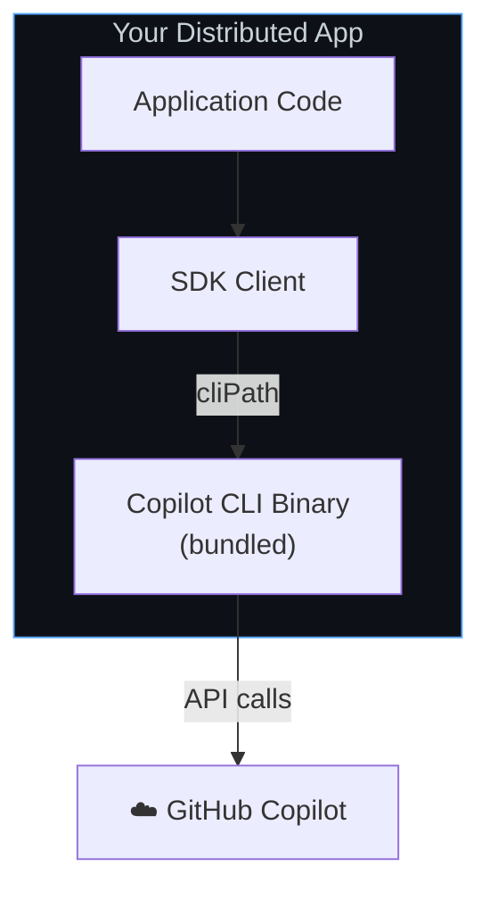
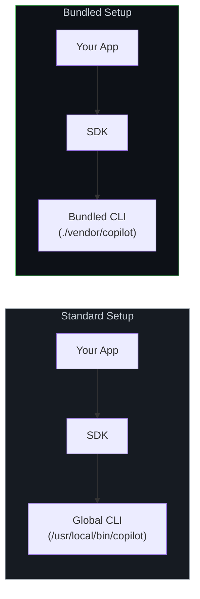
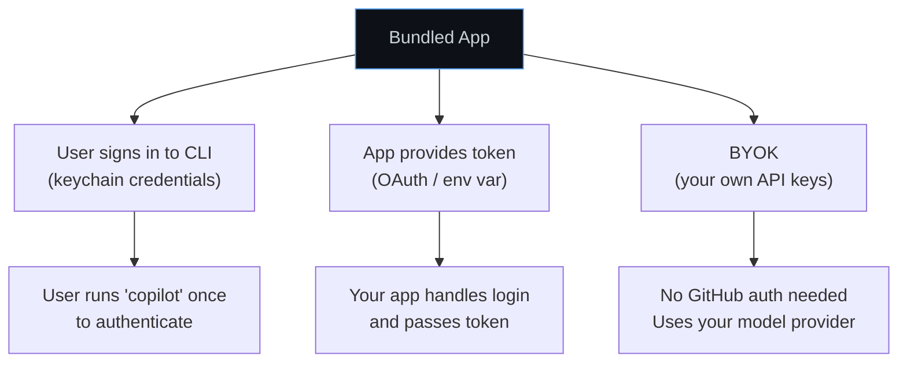
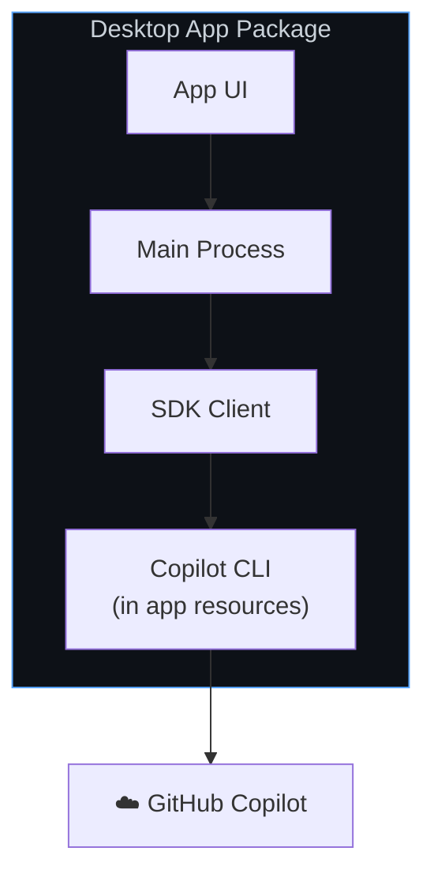

# Bundled CLI Setup

Package the Copilot CLI alongside your application so users don't need to install or configure anything separately. Your app ships with everything it needs.

**Best for:** Desktop apps, standalone tools, Electron apps, distributable CLI utilities.

## How It Works

Instead of relying on a globally installed CLI, you include the CLI binary in your application bundle. The SDK points to your bundled copy via the `cliPath` option.



**Key characteristics:**
- CLI binary ships with your app — no separate install needed
- You control the exact CLI version your app uses
- Users authenticate through your app (or use env vars / BYOK)
- Sessions are managed per-user on their machine

## Architecture: Bundled vs. Installed



## Setup

### 1. Include the CLI in Your Project

The CLI is distributed as part of the `@github/copilot` npm package. You can also obtain platform-specific binaries for your distribution pipeline.

```bash
# The CLI is available from the @github/copilot package
npm install @github/copilot
```

### 2. Point the SDK to Your Bundled CLI

<details open>
<summary><strong>Node.js / TypeScript</strong></summary>

```typescript
import { CopilotClient } from "@github/copilot-sdk";
import path from "path";

const client = new CopilotClient({
    // Point to the CLI binary in your app bundle
    cliPath: path.join(__dirname, "vendor", "copilot"),
});

const session = await client.createSession({ model: "gpt-4.1" });
const response = await session.sendAndWait({ prompt: "Hello!" });
console.log(response?.data.content);

await client.stop();
```

</details>

<details>
<summary><strong>Python</strong></summary>

```python
from copilot import CopilotClient
from pathlib import Path

client = CopilotClient({
    "cli_path": str(Path(__file__).parent / "vendor" / "copilot"),
})
await client.start()

session = await client.create_session({"model": "gpt-4.1"})
response = await session.send_and_wait({"prompt": "Hello!"})
print(response.data.content)

await client.stop()
```

</details>

<details>
<summary><strong>Go</strong></summary>

```go
client := copilot.NewClient(&copilot.ClientOptions{
    CLIPath: "./vendor/copilot",
})
if err := client.Start(ctx); err != nil {
    log.Fatal(err)
}
defer client.Stop()

session, _ := client.CreateSession(ctx, &copilot.SessionConfig{Model: "gpt-4.1"})
response, _ := session.SendAndWait(ctx, copilot.MessageOptions{Prompt: "Hello!"})
fmt.Println(*response.Data.Content)
```

</details>

<details>
<summary><strong>.NET</strong></summary>

```csharp
var client = new CopilotClient(new CopilotClientOptions
{
    CliPath = Path.Combine(AppContext.BaseDirectory, "vendor", "copilot"),
});

await using var session = await client.CreateSessionAsync(
    new SessionConfig { Model = "gpt-4.1" });

var response = await session.SendAndWaitAsync(
    new MessageOptions { Prompt = "Hello!" });
Console.WriteLine(response?.Data.Content);
```

</details>

## Authentication Strategies

When bundling, you need to decide how your users will authenticate. Here are the common patterns:



### Option A: User's Signed-In Credentials (Simplest)

The user signs in to the CLI once, and your bundled app uses those credentials. No extra code needed — this is the default behavior.

```typescript
const client = new CopilotClient({
    cliPath: path.join(__dirname, "vendor", "copilot"),
    // Default: uses signed-in user credentials
});
```

### Option B: Token via Environment Variable

Ship your app with instructions to set a token, or set it programmatically:

```typescript
const client = new CopilotClient({
    cliPath: path.join(__dirname, "vendor", "copilot"),
    env: {
        COPILOT_GITHUB_TOKEN: getUserToken(),  // Your app provides the token
    },
});
```

### Option C: BYOK (No GitHub Auth Needed)

If you manage your own model provider keys, users don't need GitHub accounts at all:

```typescript
const client = new CopilotClient({
    cliPath: path.join(__dirname, "vendor", "copilot"),
});

const session = await client.createSession({
    model: "gpt-4.1",
    provider: {
        type: "openai",
        baseUrl: "https://api.openai.com/v1",
        apiKey: process.env.OPENAI_API_KEY,
    },
});
```

See the **[BYOK guide](./byok.md)** for full details.

## Session Management

Bundled apps typically want named sessions so users can resume conversations:

```typescript
const client = new CopilotClient({
    cliPath: path.join(__dirname, "vendor", "copilot"),
});

// Create a session tied to the user's project
const sessionId = `project-${projectName}`;
const session = await client.createSession({
    sessionId,
    model: "gpt-4.1",
});

// User closes app...
// Later, resume where they left off
const resumed = await client.resumeSession(sessionId);
```

Session state persists at `~/.copilot/session-state/{sessionId}/`.

## Distribution Patterns

### Desktop App (Electron, Tauri)



Include the CLI binary in your app's resources directory:

```typescript
import { app } from "electron";
import path from "path";

const cliPath = path.join(
    app.isPackaged ? process.resourcesPath : __dirname,
    "copilot"
);

const client = new CopilotClient({ cliPath });
```

### CLI Tool

For distributable CLI tools, resolve the path relative to your binary:

```typescript
import { fileURLToPath } from "url";
import path from "path";

const __dirname = path.dirname(fileURLToPath(import.meta.url));
const cliPath = path.join(__dirname, "..", "vendor", "copilot");

const client = new CopilotClient({ cliPath });
```

## Platform-Specific Binaries

When distributing for multiple platforms, include the correct binary for each:

```
my-app/
├── vendor/
│   ├── copilot-darwin-arm64    # macOS Apple Silicon
│   ├── copilot-darwin-x64      # macOS Intel
│   ├── copilot-linux-x64       # Linux x64
│   └── copilot-win-x64.exe     # Windows x64
└── src/
    └── index.ts
```

```typescript
import os from "os";

function getCLIPath(): string {
    const platform = process.platform;   // "darwin", "linux", "win32"
    const arch = os.arch();              // "arm64", "x64"
    const ext = platform === "win32" ? ".exe" : "";
    const name = `copilot-${platform}-${arch}${ext}`;
    return path.join(__dirname, "vendor", name);
}

const client = new CopilotClient({
    cliPath: getCLIPath(),
});
```

## Limitations

| Limitation | Details |
|------------|---------|
| **Bundle size** | CLI binary adds to your app's distribution size |
| **Updates** | You manage CLI version updates in your release cycle |
| **Platform builds** | Need separate binaries for each OS/architecture |
| **Single user** | Each bundled CLI instance serves one user |

## When to Move On

| Need | Next Guide |
|------|-----------|
| Users signing in with GitHub accounts | [GitHub OAuth](./github-oauth.md) |
| Run on a server instead of user machines | [Backend Services](./backend-services.md) |
| Use your own model keys | [BYOK](./byok.md) |

## Next Steps

- **[BYOK guide](./byok.md)** — Use your own model provider keys
- **[Session Persistence](../session-persistence.md)** — Advanced session management
- **[Getting Started tutorial](../../getting-started.md)** — Build a complete app
