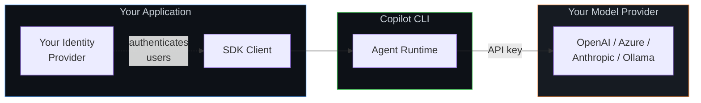
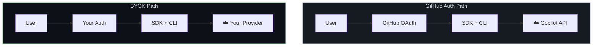
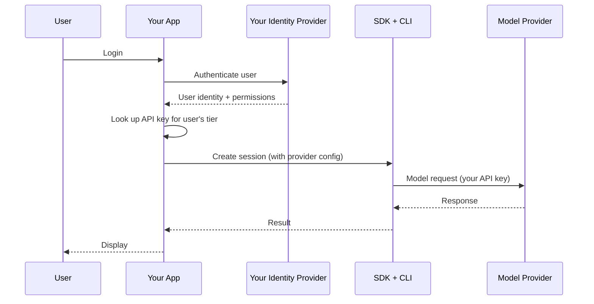
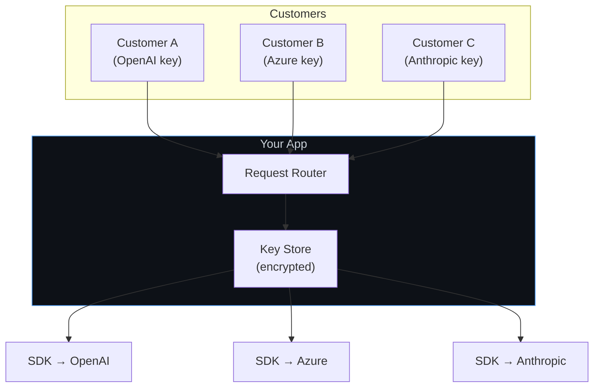

# BYOK (Bring Your Own Key) Setup

Use your own model provider API keys instead of GitHub Copilot authentication. You control the identity layer, the model provider, and the billing — the SDK provides the agent runtime.

**Best for:** Apps where users don't have GitHub accounts, enterprise deployments with existing model provider contracts, apps needing full control over identity and billing.

## How It Works

With BYOK, the SDK uses the Copilot CLI as an agent runtime only — it doesn't call GitHub's Copilot API. Instead, model requests go directly to your configured provider (OpenAI, Azure AI Foundry, Anthropic, etc.).



**Key characteristics:**
- No GitHub Copilot subscription needed
- No GitHub account needed for end users
- You manage authentication and identity yourself
- Model requests go to your provider, billed to your account
- Full agent runtime capabilities (tools, sessions, streaming) still work

## Architecture: GitHub Auth vs. BYOK



## Quick Start

<details open>
<summary><strong>Node.js / TypeScript</strong></summary>

```typescript
import { CopilotClient } from "@github/copilot-sdk";

const client = new CopilotClient();

const session = await client.createSession({
    model: "gpt-4.1",
    provider: {
        type: "openai",
        baseUrl: "https://api.openai.com/v1",
        apiKey: process.env.OPENAI_API_KEY,
    },
});

const response = await session.sendAndWait({ prompt: "Hello!" });
console.log(response?.data.content);

await client.stop();
```

</details>

<details>
<summary><strong>Python</strong></summary>

```python
import os
from copilot import CopilotClient

client = CopilotClient()
await client.start()

session = await client.create_session({
    "model": "gpt-4.1",
    "provider": {
        "type": "openai",
        "base_url": "https://api.openai.com/v1",
        "api_key": os.environ["OPENAI_API_KEY"],
    },
})

response = await session.send_and_wait({"prompt": "Hello!"})
print(response.data.content)

await client.stop()
```

</details>

<details>
<summary><strong>Go</strong></summary>

<!-- docs-validate: skip -->
```go
client := copilot.NewClient(nil)
client.Start(ctx)
defer client.Stop()

session, _ := client.CreateSession(ctx, &copilot.SessionConfig{
    Model: "gpt-4.1",
    Provider: &copilot.ProviderConfig{
        Type:    "openai",
        BaseURL: "https://api.openai.com/v1",
        APIKey:  os.Getenv("OPENAI_API_KEY"),
    },
})

response, _ := session.SendAndWait(ctx, copilot.MessageOptions{Prompt: "Hello!"})
fmt.Println(*response.Data.Content)
```

</details>

<details>
<summary><strong>.NET</strong></summary>

```csharp
await using var client = new CopilotClient();
await using var session = await client.CreateSessionAsync(new SessionConfig
{
    Model = "gpt-4.1",
    Provider = new ProviderConfig
    {
        Type = "openai",
        BaseUrl = "https://api.openai.com/v1",
        ApiKey = Environment.GetEnvironmentVariable("OPENAI_API_KEY"),
    },
});

var response = await session.SendAndWaitAsync(
    new MessageOptions { Prompt = "Hello!" });
Console.WriteLine(response?.Data.Content);
```

</details>

## Provider Configurations

### OpenAI

```typescript
provider: {
    type: "openai",
    baseUrl: "https://api.openai.com/v1",
    apiKey: process.env.OPENAI_API_KEY,
}
```

### Azure AI Foundry

```typescript
provider: {
    type: "openai",
    baseUrl: "https://your-resource.openai.azure.com/openai/v1/",
    apiKey: process.env.FOUNDRY_API_KEY,
    wireApi: "responses",  // For GPT-5 series models
}
```

### Azure OpenAI (Native)

```typescript
provider: {
    type: "azure",
    baseUrl: "https://your-resource.openai.azure.com",
    apiKey: process.env.AZURE_OPENAI_KEY,
    azure: { apiVersion: "2024-10-21" },
}
```

### Anthropic

```typescript
provider: {
    type: "anthropic",
    baseUrl: "https://api.anthropic.com",
    apiKey: process.env.ANTHROPIC_API_KEY,
}
```

### Ollama (Local)

```typescript
provider: {
    type: "openai",
    baseUrl: "http://localhost:11434/v1",
    // No API key needed for local Ollama
}
```

## Managing Identity Yourself

With BYOK, you're responsible for authentication. Here are common patterns:

### Pattern 1: Your Own Identity Provider



```typescript
// Your app handles auth, then creates sessions with your API key
app.post("/chat", authMiddleware, async (req, res) => {
    const user = req.user;  // From your auth middleware

    // Use your API key — not the user's
    const session = await getOrCreateSession(user.id, {
        model: getModelForTier(user.tier),  // "gpt-4.1" for pro, etc.
        provider: {
            type: "openai",
            baseUrl: "https://api.openai.com/v1",
            apiKey: process.env.OPENAI_API_KEY,  // Your key, your billing
        },
    });

    const response = await session.sendAndWait({ prompt: req.body.message });
    res.json({ content: response?.data.content });
});
```

### Pattern 2: Per-Customer API Keys

For B2B apps where each customer brings their own model provider keys:



```typescript
async function createSessionForCustomer(customerId: string) {
    const config = await keyStore.getProviderConfig(customerId);

    return client.createSession({
        sessionId: `customer-${customerId}-${Date.now()}`,
        model: config.model,
        provider: {
            type: config.providerType,
            baseUrl: config.baseUrl,
            apiKey: config.apiKey,
        },
    });
}
```

## Session Persistence with BYOK

When resuming BYOK sessions, you **must** re-provide the provider configuration. API keys are never persisted to disk for security.

```typescript
// Create session
const session = await client.createSession({
    sessionId: "task-123",
    model: "gpt-4.1",
    provider: {
        type: "openai",
        baseUrl: "https://api.openai.com/v1",
        apiKey: process.env.OPENAI_API_KEY,
    },
});

// Resume later — must re-provide provider config
const resumed = await client.resumeSession("task-123", {
    provider: {
        type: "openai",
        baseUrl: "https://api.openai.com/v1",
        apiKey: process.env.OPENAI_API_KEY,  // Required again
    },
});
```

## Limitations

| Limitation | Details |
|------------|---------|
| **Static credentials only** | API keys or bearer tokens — no Entra ID, OIDC, or managed identities |
| **No auto-refresh** | If a bearer token expires, you must create a new session |
| **Your billing** | All model usage is billed to your provider account |
| **Model availability** | Limited to what your provider offers |
| **Keys not persisted** | Must re-provide on session resume |

For the full BYOK reference, see the **[BYOK documentation](../../auth/byok.md)**.

## When to Move On

| Need | Next Guide |
|------|-----------|
| Run the SDK on a server | [Backend Services](./backend-services.md) |
| Multiple users with GitHub accounts | [GitHub OAuth](./github-oauth.md) |
| Handle many concurrent users | [Scaling & Multi-Tenancy](./scaling.md) |

## Next Steps

- **[BYOK reference](../../auth/byok.md)** — Full provider config details and troubleshooting
- **[Backend Services](./backend-services.md)** — Deploy the SDK server-side
- **[Scaling & Multi-Tenancy](./scaling.md)** — Serve many customers at scale
