# GitHub OAuth Setup

Let users authenticate with their GitHub accounts to use Copilot through your application. This supports individual accounts, organization memberships, and enterprise identities.

**Best for:** Multi-user apps, internal tools with org access control, SaaS products, apps where users have GitHub accounts.

## How It Works

You create a GitHub OAuth App (or GitHub App), users authorize it, and you pass their access token to the SDK. Copilot requests are made on behalf of each authenticated user, using their Copilot subscription.


**Key characteristics:**
- Each user authenticates with their own GitHub account
- Copilot usage is billed to each user's subscription
- Supports GitHub organizations and enterprise accounts
- Your app never handles model API keys — GitHub manages everything

## Architecture

```mermaid
flowchart TB
    subgraph Users["Users"]
        U1["👤 User A<br/>(Org Member)"]
        U2["👤 User B<br/>(Enterprise)"]
        U3["👤 User C<br/>(Personal)"]
    end

    subgraph App["Your Application"]
        OAuth["OAuth Flow"]
        TokenStore["Token Store"]
        SDK["SDK Client(s)"]
    end

    subgraph CLI["Copilot CLI"]
        RPC["JSON-RPC"]
    end

    U1 --> OAuth
    U2 --> OAuth
    U3 --> OAuth
    OAuth --> TokenStore
    TokenStore --> SDK
    SDK --> RPC
    RPC --> Copilot["☁️ GitHub Copilot"]

    style Users fill:#161b22,stroke:#8b949e,color:#c9d1d9
    style App fill:#0d1117,stroke:#58a6ff,color:#c9d1d9
    style CLI fill:#0d1117,stroke:#3fb950,color:#c9d1d9
```



## Step 1: Create a GitHub OAuth App

1. Go to **GitHub Settings → Developer Settings → OAuth Apps → New OAuth App**
   (or for organizations: **Organization Settings → Developer Settings**)

2. Fill in:
   - **Application name**: Your app's name
   - **Homepage URL**: Your app's URL
   - **Authorization callback URL**: Your OAuth callback endpoint (e.g., `https://yourapp.com/auth/callback`)

3. Note your **Client ID** and generate a **Client Secret**

> **GitHub App vs OAuth App:** Both work. GitHub Apps offer finer-grained permissions and are recommended for new projects. OAuth Apps are simpler to set up. The token flow is the same from the SDK's perspective.

## Step 2: Implement the OAuth Flow

Your application handles the standard GitHub OAuth flow. Here's the server-side token exchange:

```typescript
// Server-side: Exchange authorization code for user token
async function handleOAuthCallback(code: string): Promise<string> {
    const response = await fetch("https://github.com/login/oauth/access_token", {
        method: "POST",
        headers: {
            "Content-Type": "application/json",
            Accept: "application/json",
        },
        body: JSON.stringify({
            client_id: process.env.GITHUB_CLIENT_ID,
            client_secret: process.env.GITHUB_CLIENT_SECRET,
            code,
        }),
    });

    const data = await response.json();
    return data.access_token; // gho_xxxx or ghu_xxxx
}
```

## Step 3: Pass the Token to the SDK

Create a SDK client for each authenticated user, passing their token:

<details open>
<summary><strong>Node.js / TypeScript</strong></summary>

```typescript
import { CopilotClient } from "@github/copilot-sdk";

// Create a client for an authenticated user
function createClientForUser(userToken: string): CopilotClient {
    return new CopilotClient({
        githubToken: userToken,
        useLoggedInUser: false,  // Don't fall back to CLI login
    });
}

// Usage
const client = createClientForUser("gho_user_access_token");
const session = await client.createSession({
    sessionId: `user-${userId}-session`,
    model: "gpt-4.1",
});

const response = await session.sendAndWait({ prompt: "Hello!" });
```

</details>

<details>
<summary><strong>Python</strong></summary>

```python
from copilot import CopilotClient

def create_client_for_user(user_token: str) -> CopilotClient:
    return CopilotClient({
        "github_token": user_token,
        "use_logged_in_user": False,
    })

# Usage
client = create_client_for_user("gho_user_access_token")
await client.start()

session = await client.create_session({
    "session_id": f"user-{user_id}-session",
    "model": "gpt-4.1",
})

response = await session.send_and_wait({"prompt": "Hello!"})
```

</details>

<details>
<summary><strong>Go</strong></summary>

<!-- docs-validate: skip -->
```go
func createClientForUser(userToken string) *copilot.Client {
    return copilot.NewClient(&copilot.ClientOptions{
        GithubToken:     userToken,
        UseLoggedInUser: copilot.Bool(false),
    })
}

// Usage
client := createClientForUser("gho_user_access_token")
client.Start(ctx)
defer client.Stop()

session, _ := client.CreateSession(ctx, &copilot.SessionConfig{
    SessionID: fmt.Sprintf("user-%s-session", userID),
    Model:     "gpt-4.1",
})
response, _ := session.SendAndWait(ctx, copilot.MessageOptions{Prompt: "Hello!"})
```

</details>

<details>
<summary><strong>.NET</strong></summary>

<!-- docs-validate: skip -->
```csharp
CopilotClient CreateClientForUser(string userToken) =>
    new CopilotClient(new CopilotClientOptions
    {
        GithubToken = userToken,
        UseLoggedInUser = false,
    });

// Usage
await using var client = CreateClientForUser("gho_user_access_token");
await using var session = await client.CreateSessionAsync(new SessionConfig
{
    SessionId = $"user-{userId}-session",
    Model = "gpt-4.1",
});

var response = await session.SendAndWaitAsync(
    new MessageOptions { Prompt = "Hello!" });
```

</details>

## Enterprise & Organization Access

GitHub OAuth naturally supports enterprise scenarios. When users authenticate with GitHub, their org memberships and enterprise associations come along.


### Verify Organization Membership

After OAuth, check that the user belongs to your organization:

```typescript
async function verifyOrgMembership(
    token: string,
    requiredOrg: string
): Promise<boolean> {
    const response = await fetch("https://api.github.com/user/orgs", {
        headers: { Authorization: `Bearer ${token}` },
    });
    const orgs = await response.json();
    return orgs.some((org: any) => org.login === requiredOrg);
}

// In your auth flow
const token = await handleOAuthCallback(code);
if (!await verifyOrgMembership(token, "my-company")) {
    throw new Error("User is not a member of the required organization");
}
const client = createClientForUser(token);
```

### Enterprise Managed Users (EMU)

For GitHub Enterprise Managed Users, the flow is identical — EMU users authenticate through GitHub OAuth like any other user. Their enterprise policies (IP restrictions, SAML SSO) are enforced by GitHub automatically.

```typescript
// No special SDK configuration needed for EMU
// Enterprise policies are enforced server-side by GitHub
const client = new CopilotClient({
    githubToken: emuUserToken,  // Works the same as regular tokens
    useLoggedInUser: false,
});
```

## Supported Token Types

| Token Prefix | Source | Works? |
|-------------|--------|--------|
| `gho_` | OAuth user access token | ✅ |
| `ghu_` | GitHub App user access token | ✅ |
| `github_pat_` | Fine-grained personal access token | ✅ |
| `ghp_` | Classic personal access token | ❌ (deprecated) |

## Token Lifecycle


**Important:** Your application is responsible for token storage, refresh, and expiration handling. The SDK uses whatever token you provide — it doesn't manage the OAuth lifecycle.

### Token Refresh Pattern

```typescript
async function getOrRefreshToken(userId: string): Promise<string> {
    const stored = await tokenStore.get(userId);

    if (stored && !isExpired(stored)) {
        return stored.accessToken;
    }

    if (stored?.refreshToken) {
        const refreshed = await refreshGitHubToken(stored.refreshToken);
        await tokenStore.set(userId, refreshed);
        return refreshed.accessToken;
    }

    throw new Error("User must re-authenticate");
}
```

## Multi-User Patterns

### One Client Per User (Recommended)

Each user gets their own SDK client with their own token. This provides the strongest isolation.

```typescript
const clients = new Map<string, CopilotClient>();

function getClientForUser(userId: string, token: string): CopilotClient {
    if (!clients.has(userId)) {
        clients.set(userId, new CopilotClient({
            githubToken: token,
            useLoggedInUser: false,
        }));
    }
    return clients.get(userId)!;
}
```

### Shared CLI with Per-Request Tokens

For a lighter resource footprint, you can run a single external CLI server and pass tokens per session. See [Backend Services](./backend-services.md) for this pattern.

## Limitations

| Limitation | Details |
|------------|---------|
| **Copilot subscription required** | Each user needs an active Copilot subscription |
| **Token management is your responsibility** | Store, refresh, and handle expiration |
| **GitHub account required** | Users must have GitHub accounts |
| **Rate limits per user** | Subject to each user's Copilot rate limits |

## When to Move On

| Need | Next Guide |
|------|-----------|
| Users without GitHub accounts | [BYOK](./byok.md) |
| Run the SDK on servers | [Backend Services](./backend-services.md) |
| Handle many concurrent users | [Scaling & Multi-Tenancy](./scaling.md) |

## Next Steps

- **[Authentication docs](../../auth/index.md)** — Full auth method reference
- **[Backend Services](./backend-services.md)** — Run the SDK server-side
- **[Scaling & Multi-Tenancy](./scaling.md)** — Handle many users at scale
