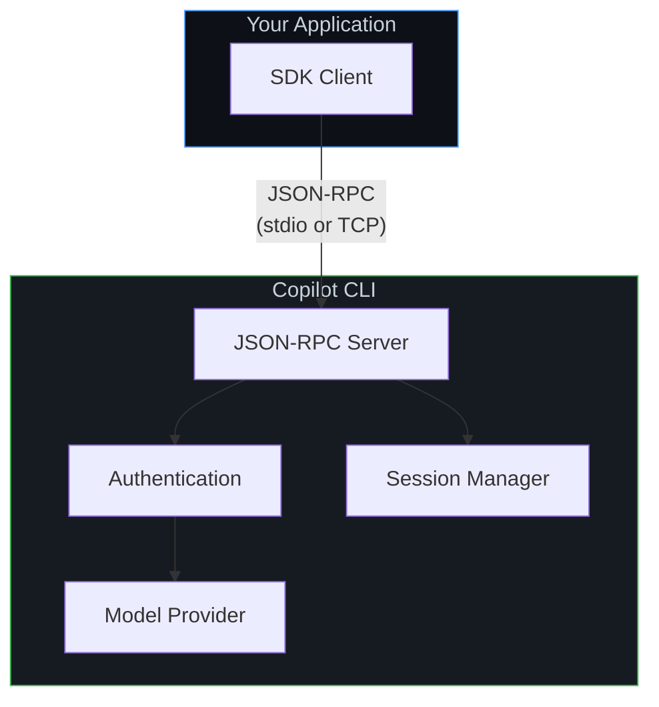
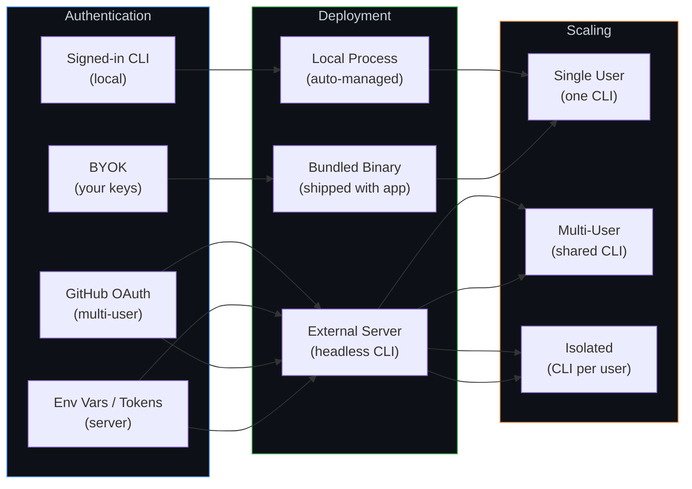

# Setup Guides

These guides walk you through configuring the Copilot SDK for your specific use case — from personal side projects to production platforms serving thousands of users.

## Architecture at a Glance

Every Copilot SDK integration follows the same core pattern: your application talks to the SDK, which communicates with the Copilot CLI over JSON-RPC. What changes across setups is **where the CLI runs**, **how users authenticate**, and **how sessions are managed**.

The setup guides below help you configure each layer for your scenario.

## Who Are You?

### 🧑‍💻 Hobbyist

You're building a personal assistant, side project, or experimental app. You want the simplest path to getting Copilot in your code.

**Start with:**
1. **[Local CLI](./local-cli.md)** — Use the CLI already signed in on your machine
2. **[Bundled CLI](./bundled-cli.md)** — Package everything into a standalone app

### 🏢 Internal App Developer

You're building tools for your team or company. Users are employees who need to authenticate with their enterprise GitHub accounts or org memberships.

**Start with:**
1. **[GitHub OAuth](./github-oauth.md)** — Let employees sign in with their GitHub accounts
2. **[Backend Services](./backend-services.md)** — Run the SDK in your internal services

**If scaling beyond a single server:**
3. **[Scaling & Multi-Tenancy](./scaling.md)** — Handle multiple users and services

### 🚀 App Developer (ISV)

You're building a product for customers. You need to handle authentication for your users — either through GitHub or by managing identity yourself.

**Start with:**
1. **[GitHub OAuth](./github-oauth.md)** — Let customers sign in with GitHub
2. **[BYOK](./byok.md)** — Manage identity yourself with your own model keys
3. **[Backend Services](./backend-services.md)** — Power your product from server-side code

**For production:**
4. **[Scaling & Multi-Tenancy](./scaling.md)** — Serve many customers reliably

### 🏗️ Platform Developer

You're embedding Copilot into a platform — APIs, developer tools, or infrastructure that other developers build on. You need fine-grained control over sessions, scaling, and multi-tenancy.

**Start with:**
1. **[Backend Services](./backend-services.md)** — Core server-side integration
2. **[Scaling & Multi-Tenancy](./scaling.md)** — Session isolation, horizontal scaling, persistence

**Depending on your auth model:**
3. **[GitHub OAuth](./github-oauth.md)** — For GitHub-authenticated users
4. **[BYOK](./byok.md)** — For self-managed identity and model access

## Decision Matrix

Use this table to find the right guides based on what you need to do:

| What you need | Guide |
|---------------|-------|
| Simplest possible setup | [Local CLI](./local-cli.md) |
| Ship a standalone app with Copilot | [Bundled CLI](./bundled-cli.md) |
| Users sign in with GitHub | [GitHub OAuth](./github-oauth.md) |
| Use your own model keys (OpenAI, Azure, etc.) | [BYOK](./byok.md) |
| Run the SDK on a server | [Backend Services](./backend-services.md) |
| Serve multiple users / scale horizontally | [Scaling & Multi-Tenancy](./scaling.md) |

## Configuration Comparison

## Prerequisites

All guides assume you have:

- **Copilot CLI** installed ([Installation guide](https://docs.github.com/en/copilot/how-tos/set-up/install-copilot-cli))
- **One of the SDKs** installed:
  - Node.js: `npm install @github/copilot-sdk`
  - Python: `pip install github-copilot-sdk`
  - Go: `go get github.com/github/copilot-sdk/go`
  - .NET: `dotnet add package GitHub.Copilot.SDK`

If you're brand new, start with the **[Getting Started tutorial](../../getting-started.md)** first, then come back here for production configuration.

## Next Steps

Pick the guide that matches your situation from the [decision matrix](#decision-matrix) above, or start with the persona description closest to your role.
