# Local CLI Setup

Use the Copilot SDK with the CLI already signed in on your machine. This is the simplest configuration — zero auth code, zero infrastructure.

**Best for:** Personal projects, prototyping, local development, learning the SDK.

## How It Works

When you install the Copilot CLI and sign in, your credentials are stored in the system keychain. The SDK automatically starts the CLI as a child process and uses those stored credentials.

```mermaid
flowchart LR
    subgraph YourMachine["Your Machine"]
        App["Your App"] --> SDK["SDK Client"]
        SDK -- "stdio" --> CLI["Copilot CLI<br/>(auto-started)"]
        CLI --> Keychain["🔐 System Keychain<br/>(stored credentials)"]
    end
    CLI -- "API calls" --> Copilot["☁️ GitHub Copilot"]

    style YourMachine fill:#0d1117,stroke:#58a6ff,color:#c9d1d9
```



**Key characteristics:**
- CLI is spawned automatically by the SDK (no setup needed)
- Authentication uses the signed-in user's credentials from the system keychain
- Communication happens over stdio (stdin/stdout) — no network ports
- Sessions are local to your machine

## Quick Start

The default configuration requires no options at all:

<details open>
<summary><strong>Node.js / TypeScript</strong></summary>

```typescript
import { CopilotClient } from "@github/copilot-sdk";

const client = new CopilotClient();
const session = await client.createSession({ model: "gpt-4.1" });

const response = await session.sendAndWait({ prompt: "Hello!" });
console.log(response?.data.content);

await client.stop();
```

</details>

<details>
<summary><strong>Python</strong></summary>

```python
from copilot import CopilotClient

client = CopilotClient()
await client.start()

session = await client.create_session({"model": "gpt-4.1"})
response = await session.send_and_wait({"prompt": "Hello!"})
print(response.data.content)

await client.stop()
```

</details>

<details>
<summary><strong>Go</strong></summary>

<!-- docs-validate: skip -->
```go
client := copilot.NewClient(nil)
if err := client.Start(ctx); err != nil {
    log.Fatal(err)
}
defer client.Stop()

session, _ := client.CreateSession(ctx, &copilot.SessionConfig{Model: "gpt-4.1"})
response, _ := session.SendAndWait(ctx, copilot.MessageOptions{Prompt: "Hello!"})
fmt.Println(*response.Data.Content)
```

</details>

<details>
<summary><strong>.NET</strong></summary>

```csharp
await using var client = new CopilotClient();
await using var session = await client.CreateSessionAsync(
    new SessionConfig { Model = "gpt-4.1" });

var response = await session.SendAndWaitAsync(
    new MessageOptions { Prompt = "Hello!" });
Console.WriteLine(response?.Data.Content);
```

</details>

That's it. The SDK handles everything: starting the CLI, authenticating, and managing the session.

## What's Happening Under the Hood


## Configuration Options

While defaults work great, you can customize the local setup:

```typescript
const client = new CopilotClient({
    // Override CLI location (default: bundled with @github/copilot)
    cliPath: "/usr/local/bin/copilot",

    // Set log level for debugging
    logLevel: "debug",

    // Pass extra CLI arguments
    cliArgs: ["--disable-telemetry"],

    // Set working directory
    cwd: "/path/to/project",

    // Auto-restart CLI if it crashes (default: true)
    autoRestart: true,
});
```

## Using Environment Variables

Instead of the keychain, you can authenticate via environment variables. This is useful for CI or when you don't want interactive login.

```bash
# Set one of these (in priority order):
export COPILOT_GITHUB_TOKEN="gho_xxxx"   # Recommended
export GH_TOKEN="gho_xxxx"               # GitHub CLI compatible
export GITHUB_TOKEN="gho_xxxx"           # GitHub Actions compatible
```

The SDK picks these up automatically — no code changes needed.

## Managing Sessions

With the local CLI, sessions default to ephemeral. To create resumable sessions, provide your own session ID:

```typescript
// Create a named session
const session = await client.createSession({
    sessionId: "my-project-analysis",
    model: "gpt-4.1",
});

// Later, resume it
const resumed = await client.resumeSession("my-project-analysis");
```

Session state is stored locally at `~/.copilot/session-state/{sessionId}/`.

## Limitations

| Limitation | Details |
|------------|---------|
| **Single user** | Credentials are tied to whoever signed in to the CLI |
| **Local only** | The CLI runs on the same machine as your app |
| **No multi-tenant** | Can't serve multiple users from one CLI instance |
| **Requires CLI login** | User must run `copilot` and authenticate first |

## When to Move On

If you need any of these, it's time to pick a more advanced setup:

| Need | Next Guide |
|------|-----------|
| Ship your app to others | [Bundled CLI](./bundled-cli.md) |
| Multiple users signing in | [GitHub OAuth](./github-oauth.md) |
| Run on a server | [Backend Services](./backend-services.md) |
| Use your own model keys | [BYOK](./byok.md) |

## Next Steps

- **[Getting Started tutorial](../../getting-started.md)** — Build a complete interactive app
- **[Authentication docs](../../auth/index.md)** — All auth methods in detail
- **[Session Persistence](../session-persistence.md)** — Advanced session management
