# Scaling & Multi-Tenancy

Design your Copilot SDK deployment to serve multiple users, handle concurrent sessions, and scale horizontally across infrastructure. This guide covers session isolation patterns, scaling topologies, and production best practices.

**Best for:** Platform developers, SaaS builders, any deployment serving more than a handful of concurrent users.

## Core Concepts

Before choosing a pattern, understand three dimensions of scaling:

```mermaid
flowchart TB
    subgraph Dimensions["Scaling Dimensions"]
        direction LR
        I["🔒 Isolation<br/>Who sees what?"]
        C["⚡ Concurrency<br/>How many at once?"]
        P["💾 Persistence<br/>How long do sessions live?"]
    end

    I --> I1["Shared CLI<br/>vs. CLI per user"]
    C --> C1["Session pooling<br/>vs. on-demand"]
    P --> P1["Ephemeral<br/>vs. persistent"]

    style Dimensions fill:#0d1117,stroke:#58a6ff,color:#c9d1d9
```



## Session Isolation Patterns

### Pattern 1: Isolated CLI Per User

Each user gets their own CLI server instance. Strongest isolation — a user's sessions, memory, and processes are completely separated.

```mermaid
flowchart TB
    LB["Load Balancer"]

    subgraph User_A["User A"]
        SDK_A["SDK Client"] --> CLI_A["CLI Server A<br/>:4321"]
        CLI_A --> SA["📁 Sessions A"]
    end

    subgraph User_B["User B"]
        SDK_B["SDK Client"] --> CLI_B["CLI Server B<br/>:4322"]
        CLI_B --> SB["📁 Sessions B"]
    end

    subgraph User_C["User C"]
        SDK_C["SDK Client"] --> CLI_C["CLI Server C<br/>:4323"]
        CLI_C --> SC["📁 Sessions C"]
    end

    LB --> SDK_A
    LB --> SDK_B
    LB --> SDK_C

    style User_A fill:#0d1117,stroke:#3fb950,color:#c9d1d9
    style User_B fill:#0d1117,stroke:#3fb950,color:#c9d1d9
    style User_C fill:#0d1117,stroke:#3fb950,color:#c9d1d9
```



**When to use:**
- Multi-tenant SaaS where data isolation is critical
- Users with different auth credentials
- Compliance requirements (SOC 2, HIPAA)

```typescript
// CLI pool manager — one CLI per user
class CLIPool {
    private instances = new Map<string, { client: CopilotClient; port: number }>();
    private nextPort = 5000;

    async getClientForUser(userId: string, token?: string): Promise<CopilotClient> {
        if (this.instances.has(userId)) {
            return this.instances.get(userId)!.client;
        }

        const port = this.nextPort++;

        // Spawn a dedicated CLI for this user
        await spawnCLI(port, token);

        const client = new CopilotClient({
            cliUrl: `localhost:${port}`,
        });

        this.instances.set(userId, { client, port });
        return client;
    }

    async releaseUser(userId: string): Promise<void> {
        const instance = this.instances.get(userId);
        if (instance) {
            await instance.client.stop();
            this.instances.delete(userId);
        }
    }
}
```

### Pattern 2: Shared CLI with Session Isolation

Multiple users share one CLI server but have isolated sessions via unique session IDs. Lighter on resources, but weaker isolation.

```mermaid
flowchart TB
    U1["👤 User A"]
    U2["👤 User B"]
    U3["👤 User C"]

    subgraph App["Your App"]
        Router["Session Router"]
    end

    subgraph CLI["Shared CLI Server :4321"]
        SA["Session: user-a-chat"]
        SB["Session: user-b-chat"]
        SC["Session: user-c-chat"]
    end

    U1 --> Router
    U2 --> Router
    U3 --> Router

    Router --> SA
    Router --> SB
    Router --> SC

    style App fill:#0d1117,stroke:#58a6ff,color:#c9d1d9
    style CLI fill:#0d1117,stroke:#3fb950,color:#c9d1d9
```



**When to use:**
- Internal tools with trusted users
- Resource-constrained environments
- Lower isolation requirements

```typescript
const sharedClient = new CopilotClient({
    cliUrl: "localhost:4321",
});

// Enforce session isolation through naming conventions
function getSessionId(userId: string, purpose: string): string {
    return `${userId}-${purpose}-${Date.now()}`;
}

// Access control: ensure users can only access their own sessions
async function resumeSessionWithAuth(
    sessionId: string,
    currentUserId: string
): Promise<Session> {
    const [sessionUserId] = sessionId.split("-");
    if (sessionUserId !== currentUserId) {
        throw new Error("Access denied: session belongs to another user");
    }
    return sharedClient.resumeSession(sessionId);
}
```

### Pattern 3: Shared Sessions (Collaborative)

Multiple users interact with the same session — like a shared chat room with Copilot.

```mermaid
flowchart TB
    U1["👤 Alice"]
    U2["👤 Bob"]
    U3["👤 Carol"]

    subgraph App["Collaboration Layer"]
        Queue["Message Queue<br/>(serialize access)"]
        Lock["Session Lock"]
    end

    subgraph CLI["CLI Server"]
        Session["Shared Session:<br/>team-project-review"]
    end

    U1 --> Queue
    U2 --> Queue
    U3 --> Queue

    Queue --> Lock
    Lock --> Session

    style App fill:#0d1117,stroke:#58a6ff,color:#c9d1d9
    style CLI fill:#0d1117,stroke:#3fb950,color:#c9d1d9
```



**When to use:**
- Team collaboration tools
- Shared code review sessions
- Pair programming assistants

> ⚠️ **Important:** The SDK doesn't provide built-in session locking. You **must** serialize access to prevent concurrent writes to the same session.

```typescript
import Redis from "ioredis";

const redis = new Redis();

async function withSessionLock<T>(
    sessionId: string,
    fn: () => Promise<T>,
    timeoutSec = 300
): Promise<T> {
    const lockKey = `session-lock:${sessionId}`;
    const lockId = crypto.randomUUID();

    // Acquire lock
    const acquired = await redis.set(lockKey, lockId, "NX", "EX", timeoutSec);
    if (!acquired) {
        throw new Error("Session is in use by another user");
    }

    try {
        return await fn();
    } finally {
        // Release lock (only if we still own it)
        const currentLock = await redis.get(lockKey);
        if (currentLock === lockId) {
            await redis.del(lockKey);
        }
    }
}

// Usage: serialize access to shared session
app.post("/team-chat", authMiddleware, async (req, res) => {
    const result = await withSessionLock("team-project-review", async () => {
        const session = await client.resumeSession("team-project-review");
        return session.sendAndWait({ prompt: req.body.message });
    });

    res.json({ content: result?.data.content });
});
```

## Comparison of Isolation Patterns

| | Isolated CLI Per User | Shared CLI + Session Isolation | Shared Sessions |
|---|---|---|---|
| **Isolation** | ✅ Complete | ⚠️ Logical | ❌ Shared |
| **Resource usage** | High (CLI per user) | Low (one CLI) | Low (one CLI + session) |
| **Complexity** | Medium | Low | High (locking) |
| **Auth flexibility** | ✅ Per-user tokens | ⚠️ Service token | ⚠️ Service token |
| **Best for** | Multi-tenant SaaS | Internal tools | Collaboration |

## Horizontal Scaling

### Multiple CLI Servers Behind a Load Balancer

```mermaid
flowchart TB
    Users["👥 Users"] --> LB["Load Balancer"]

    subgraph Pool["CLI Server Pool"]
        CLI1["CLI Server 1<br/>:4321"]
        CLI2["CLI Server 2<br/>:4322"]
        CLI3["CLI Server 3<br/>:4323"]
    end

    subgraph Storage["Shared Storage"]
        NFS["📁 Network File System<br/>or Cloud Storage"]
    end

    LB --> CLI1
    LB --> CLI2
    LB --> CLI3

    CLI1 --> NFS
    CLI2 --> NFS
    CLI3 --> NFS

    style Pool fill:#0d1117,stroke:#3fb950,color:#c9d1d9
    style Storage fill:#161b22,stroke:#f0883e,color:#c9d1d9
```



**Key requirement:** Session state must be on **shared storage** so any CLI server can resume any session.

```typescript
// Route sessions to CLI servers
class CLILoadBalancer {
    private servers: string[];
    private currentIndex = 0;

    constructor(servers: string[]) {
        this.servers = servers;
    }

    // Round-robin selection
    getNextServer(): string {
        const server = this.servers[this.currentIndex];
        this.currentIndex = (this.currentIndex + 1) % this.servers.length;
        return server;
    }

    // Sticky sessions: same user always hits same server
    getServerForUser(userId: string): string {
        const hash = this.hashCode(userId);
        return this.servers[hash % this.servers.length];
    }

    private hashCode(str: string): number {
        let hash = 0;
        for (let i = 0; i < str.length; i++) {
            hash = (hash << 5) - hash + str.charCodeAt(i);
            hash |= 0;
        }
        return Math.abs(hash);
    }
}

const lb = new CLILoadBalancer([
    "cli-1:4321",
    "cli-2:4321",
    "cli-3:4321",
]);

app.post("/chat", async (req, res) => {
    const server = lb.getServerForUser(req.user.id);
    const client = new CopilotClient({ cliUrl: server });

    const session = await client.createSession({
        sessionId: `user-${req.user.id}-chat`,
        model: "gpt-4.1",
    });

    const response = await session.sendAndWait({ prompt: req.body.message });
    res.json({ content: response?.data.content });
});
```

### Sticky Sessions vs. Shared Storage

```mermaid
flowchart LR
    subgraph Sticky["Sticky Sessions"]
        direction TB
        S1["User A → always CLI 1"]
        S2["User B → always CLI 2"]
        S3["✅ No shared storage needed"]
        S4["❌ Uneven load if users vary"]
    end

    subgraph Shared["Shared Storage"]
        direction TB
        SH1["User A → any CLI"]
        SH2["User B → any CLI"]
        SH3["✅ Even load distribution"]
        SH4["❌ Requires NFS / cloud storage"]
    end

    style Sticky fill:#0d1117,stroke:#58a6ff,color:#c9d1d9
    style Shared fill:#0d1117,stroke:#3fb950,color:#c9d1d9
```



**Sticky sessions** are simpler — pin users to specific CLI servers. No shared storage needed, but load distribution is uneven.

**Shared storage** enables any CLI to handle any session. Better load distribution, but requires networked storage for `~/.copilot/session-state/`.

## Vertical Scaling

### Tuning a Single CLI Server

A single CLI server can handle many concurrent sessions. Key considerations:


**Session lifecycle management** is key to vertical scaling:

```typescript
// Limit concurrent active sessions
class SessionManager {
    private activeSessions = new Map<string, Session>();
    private maxConcurrent: number;

    constructor(maxConcurrent = 50) {
        this.maxConcurrent = maxConcurrent;
    }

    async getSession(sessionId: string): Promise<Session> {
        // Return existing active session
        if (this.activeSessions.has(sessionId)) {
            return this.activeSessions.get(sessionId)!;
        }

        // Enforce concurrency limit
        if (this.activeSessions.size >= this.maxConcurrent) {
            await this.evictOldestSession();
        }

        // Create or resume
        const session = await client.createSession({
            sessionId,
            model: "gpt-4.1",
        });

        this.activeSessions.set(sessionId, session);
        return session;
    }

    private async evictOldestSession(): Promise<void> {
        const [oldestId] = this.activeSessions.keys();
        const session = this.activeSessions.get(oldestId)!;
        // Session state is persisted automatically — safe to destroy
        await session.destroy();
        this.activeSessions.delete(oldestId);
    }
}
```

## Ephemeral vs. Persistent Sessions


### Ephemeral Sessions

For stateless API endpoints where each request is independent:

```typescript
app.post("/api/analyze", async (req, res) => {
    const session = await client.createSession({
        model: "gpt-4.1",
    });

    try {
        const response = await session.sendAndWait({
            prompt: req.body.prompt,
        });
        res.json({ result: response?.data.content });
    } finally {
        await session.destroy();  // Clean up immediately
    }
});
```

### Persistent Sessions

For conversational interfaces or long-running workflows:

```typescript
// Create a resumable session
app.post("/api/chat/start", async (req, res) => {
    const sessionId = `user-${req.user.id}-${Date.now()}`;

    const session = await client.createSession({
        sessionId,
        model: "gpt-4.1",
        infiniteSessions: {
            enabled: true,
            backgroundCompactionThreshold: 0.80,
        },
    });

    res.json({ sessionId });
});

// Continue the conversation
app.post("/api/chat/message", async (req, res) => {
    const session = await client.resumeSession(req.body.sessionId);
    const response = await session.sendAndWait({ prompt: req.body.message });

    res.json({ content: response?.data.content });
});

// Clean up when done
app.post("/api/chat/end", async (req, res) => {
    await client.deleteSession(req.body.sessionId);
    res.json({ success: true });
});
```

## Container Deployments

### Kubernetes with Persistent Storage

```yaml
apiVersion: apps/v1
kind: Deployment
metadata:
  name: copilot-cli
spec:
  replicas: 3
  selector:
    matchLabels:
      app: copilot-cli
  template:
    metadata:
      labels:
        app: copilot-cli
    spec:
      containers:
        - name: copilot-cli
          image: ghcr.io/github/copilot-cli:latest
          args: ["--headless", "--port", "4321"]
          env:
            - name: COPILOT_GITHUB_TOKEN
              valueFrom:
                secretKeyRef:
                  name: copilot-secrets
                  key: github-token
          ports:
            - containerPort: 4321
          volumeMounts:
            - name: session-state
              mountPath: /root/.copilot/session-state
      volumes:
        - name: session-state
          persistentVolumeClaim:
            claimName: copilot-sessions-pvc
---
apiVersion: v1
kind: Service
metadata:
  name: copilot-cli
spec:
  selector:
    app: copilot-cli
  ports:
    - port: 4321
      targetPort: 4321
```


### Azure Container Instances

```yaml
containers:
  - name: copilot-cli
    image: ghcr.io/github/copilot-cli:latest
    command: ["copilot", "--headless", "--port", "4321"]
    volumeMounts:
      - name: session-storage
        mountPath: /root/.copilot/session-state

volumes:
  - name: session-storage
    azureFile:
      shareName: copilot-sessions
      storageAccountName: myaccount
```

## Production Checklist

```mermaid
flowchart TB
    subgraph Checklist["Production Readiness"]
        direction TB
        A["✅ Session cleanup<br/>cron / TTL"]
        B["✅ Health checks<br/>ping endpoint"]
        C["✅ Persistent storage<br/>for session state"]
        D["✅ Secret management<br/>for tokens/keys"]
        E["✅ Monitoring<br/>active sessions, latency"]
        F["✅ Session locking<br/>if shared sessions"]
        G["✅ Graceful shutdown<br/>drain active sessions"]
    end

    style Checklist fill:#0d1117,stroke:#3fb950,color:#c9d1d9
```



| Concern | Recommendation |
|---------|---------------|
| **Session cleanup** | Run periodic cleanup to delete sessions older than your TTL |
| **Health checks** | Ping the CLI server periodically; restart if unresponsive |
| **Storage** | Mount persistent volumes for `~/.copilot/session-state/` |
| **Secrets** | Use your platform's secret manager (Vault, K8s Secrets, etc.) |
| **Monitoring** | Track active session count, response latency, error rates |
| **Locking** | Use Redis or similar for shared session access |
| **Shutdown** | Drain active sessions before stopping CLI servers |

## Limitations

| Limitation | Details |
|------------|---------|
| **No built-in session locking** | Implement application-level locking for concurrent access |
| **No built-in load balancing** | Use external LB or service mesh |
| **Session state is file-based** | Requires shared filesystem for multi-server setups |
| **30-minute idle timeout** | Sessions without activity are auto-cleaned by the CLI |
| **CLI is single-process** | Scale by adding more CLI server instances, not threads |

## Next Steps

- **[Session Persistence](../session-persistence.md)** — Deep dive on resumable sessions
- **[Backend Services](./backend-services.md)** — Core server-side setup
- **[GitHub OAuth](./github-oauth.md)** — Multi-user authentication
- **[BYOK](./byok.md)** — Use your own model provider
